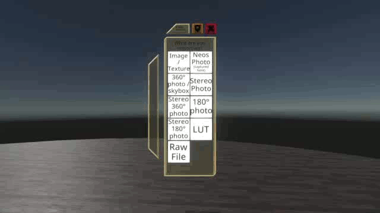
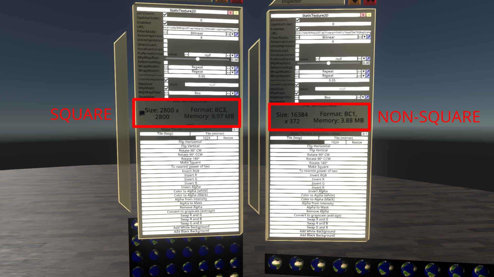

# GifImporter

[ResoniteModLoader](https://github.com/resonite-modding-group/ResoniteModLoader) mod for [Resonite](https://resonite.com/) that allows you to
essentially import gif images. It converts gifs to a spritesheet then adds the appropriate components.

Related issue on [NeosPublic](https://github.com/Neos-Metaverse/NeosPublic/) issue tracker: 
[261](https://github.com/Neos-Metaverse/NeosPublic/issues/261) *I am keeping this here as it still relates*

## Usage

Simply import a `gif` image like you would any other image (such as the `gif` above).

## Square tiles

As noted in the config, square tiles can sometimes make a bigger size tilesheet.

## Note for linux users

Install `libgdiplus` for your distro.

## Installation
1. Install [ResoniteModLoader](https://github.com/resonite-modding-group/ResoniteModLoader).
2. Place [GifImporter.dll](https://github.com/LeCloutPanda/GifImporter/releases/latest/download/GifImporter.dll) into your `rml_mods` folder. This folder should be at `C:\Program Files (x86)\Steam\steamapps\common\Resonite\rml_mods` for a default install. You can create it if it's missing, or if you launch the game once with ResoniteModLoader installed it will create the folder for you.
3. Start the game. If you want to verify that the mod is working you can check your Resonite logs. 
