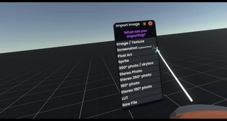
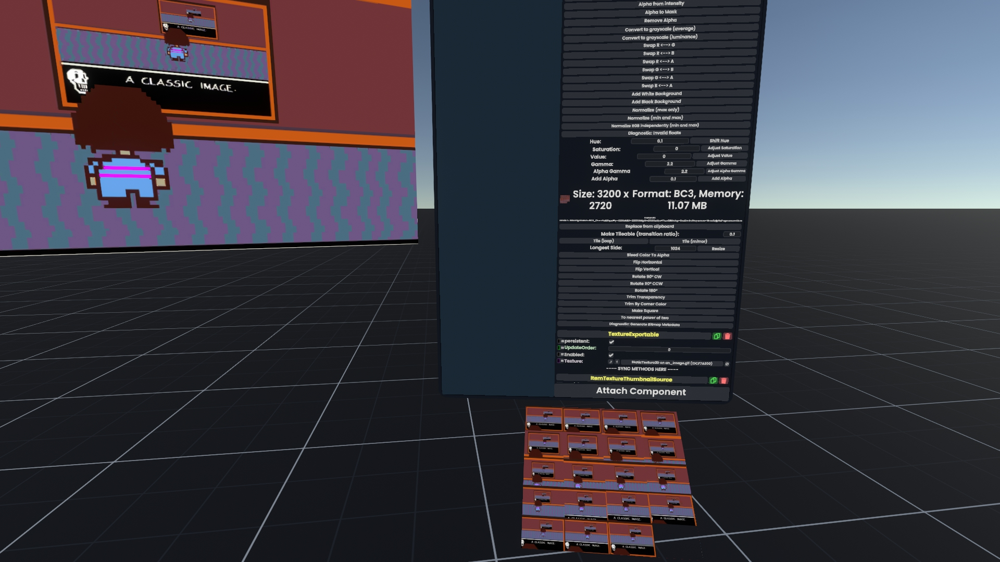
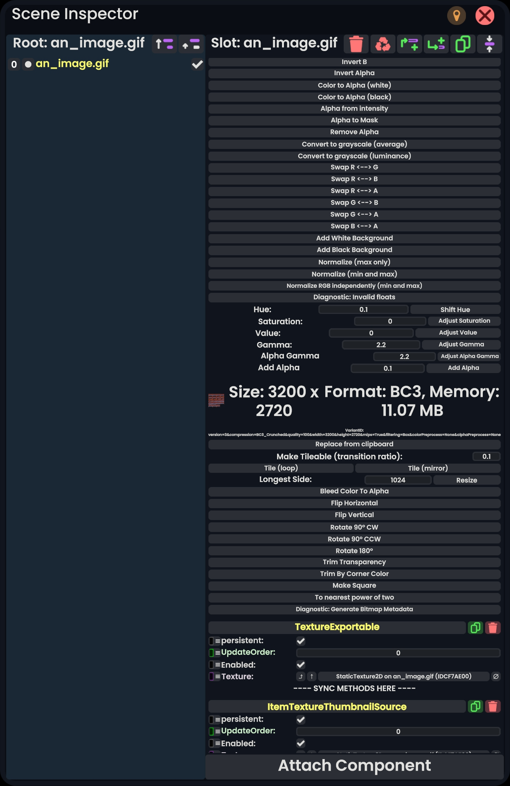
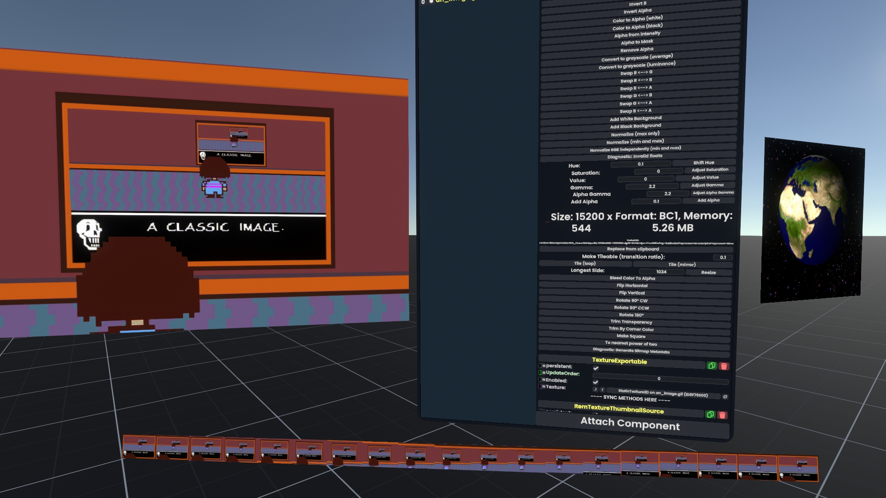
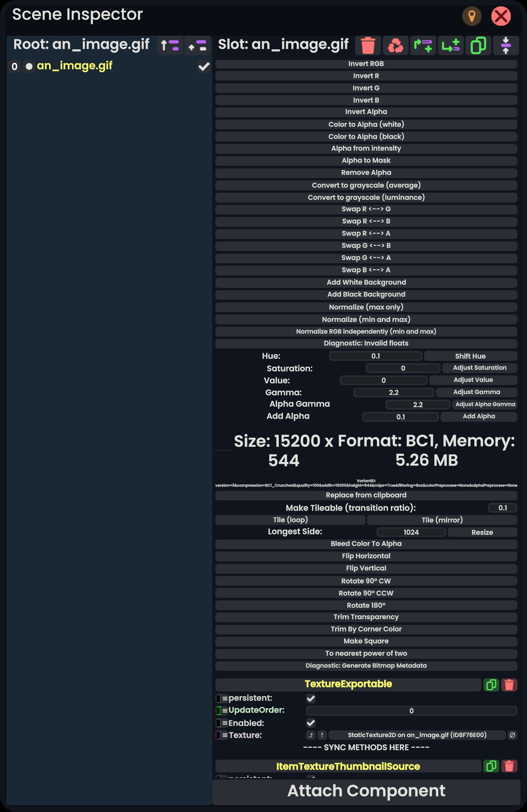

# GifImporter

[ResoniteModLoader](https://github.com/resonite-modding-group/ResoniteModLoader) mod for [Resonite](https://resonite.com/) that allows you to
essentially import gif images. It converts gifs to a spritesheet then adds the appropriate components.

Related issue on [Resonite-Issues](https://github.com/Yellow-Dog-Man/Resonite-Issues/) issue tracker: 
[#1266](https://github.com/Yellow-Dog-Man/Resonite-Issues/issues/1266)

## Usage

Simply import a `gif` image like you would any other image (such as the `gif` above).

## Configuration

The GifImporter has a configuration item that can be managed with the [badhaloninja/ResoniteModSettings](https://github.com/badhaloninja/ResoniteModSettings) Mod; and exposes a single boolean setting to enable "Square Tiles" or "Non-Square Tiles" when not enabled.  This setting affects both the orientation of the Sprite Sheet as well as the Filesize and Quality.

### Square tiles

With the setting enabled, the sprite sheet is Square and the tiles are placed in the x/y coordinates.

### Non-Square tiles

With the setting disabled, the sprite sheet is linear and the tiles are placed in the y coordinate space

As noted in the config, square tiles can sometimes make a bigger size tilesheet.

## Note for linux users

Install `libgdiplus` for your distro.

## Installation
1. Install [ResoniteModLoader](https://github.com/resonite-modding-group/ResoniteModLoader).
2. Place [GifImporter.dll](https://github.com/astralchan/GifImporter/releases/latest/download/GifImporter.dll) into your `rml_mods` folder. This folder should be at `C:\Program Files (x86)\Steam\steamapps\common\Resonite\rml_mods` for a default install. You can create it if it's missing, or if you launch the game once with ResoniteModLoader installed it will create the folder for you.
3. Start the game. If you want to verify that the mod is working you can check your Resonite logs. 
